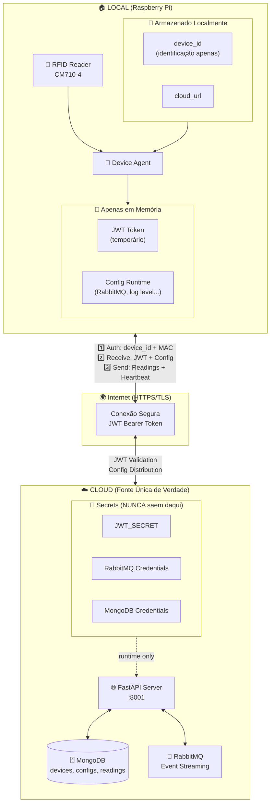
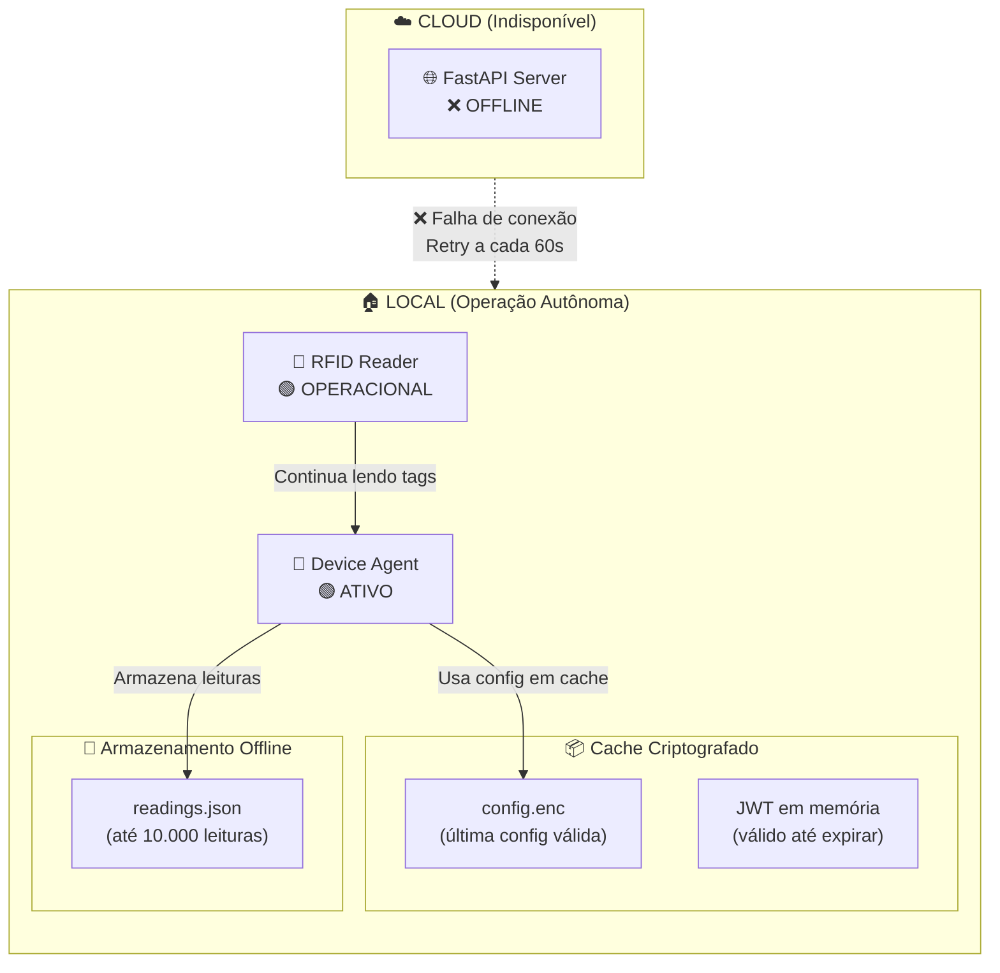
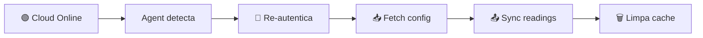
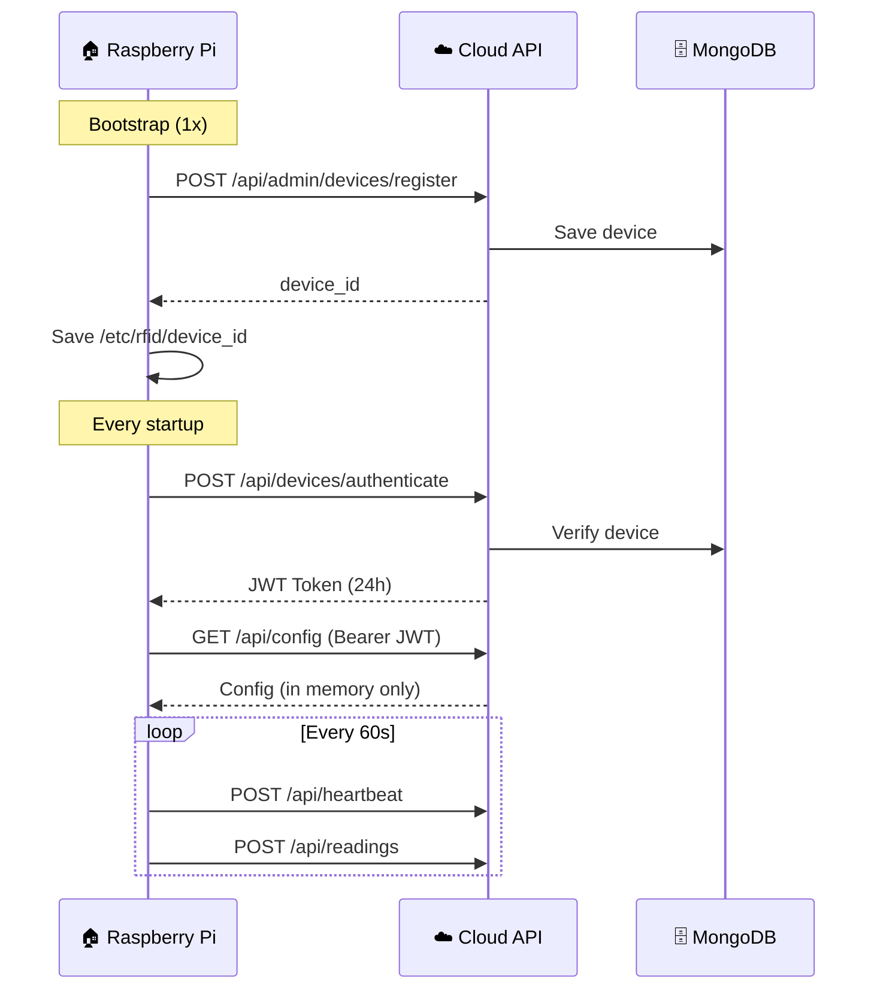

# Arquitetura do Sistema

## Preview 1 – Arquitetura Geral (Cloud + Local Hybrid)

```mermaid
flowchart TB
    subgraph CLOUD["☁️ CLOUD (Fonte Única de Verdade)"]
        direction TB
        subgraph SECRETS["🔐 Secrets (NUNCA saem daqui)"]
            JWT_SECRET["JWT_SECRET"]
            RABBITMQ_CREDS["RabbitMQ Credentials"]
            DB_CREDS["MongoDB Credentials"]
        end
        
        API["🌐 FastAPI Server<br/>:8001"]
        MONGO[("🗄️ MongoDB<br/>devices, configs, readings")]
        RABBIT["🐰 RabbitMQ<br/>Event Streaming"]
        
        API <--> MONGO
        API <--> RABBIT
        SECRETS -.->|"runtime only"| API
    end
    
    subgraph INTERNET["🌍 Internet (HTTPS/TLS)"]
        CONN["Conexão Segura<br/>JWT Bearer Token"]
    end
    
    subgraph LOCAL["🏠 LOCAL (Raspberry Pi)"]
        direction TB
        subgraph STORED["📁 Armazenado Localmente"]
            DEVICE_ID["device_id<br/>(identificação apenas)"]
            CLOUD_URL["cloud_url"]
        end
        
        subgraph MEMORY["💾 Apenas em Memória"]
            JWT_TOKEN["JWT Token<br/>(temporário)"]
            CONFIG["Config Runtime<br/>(RabbitMQ, log level...)"]
        end
        
        AGENT["🤖 Device Agent"]
        READER["📡 RFID Reader<br/>CM710-4"]
        
        STORED --> AGENT
        AGENT --> MEMORY
        READER --> AGENT
    end
    
    LOCAL <-->|"1️⃣ Auth: device_id + MAC<br/>2️⃣ Receive: JWT + Config<br/>3️⃣ Send: Readings + Heartbeat"| CONN
    CONN <-->|"JWT Validation<br/>Config Distribution"| CLOUD
```

## Preview 2 – Modo Degradado (Cloud Offline)

```mermaid
flowchart TB
    subgraph CLOUD["☁️ CLOUD (Indisponível)"]
        API["🌐 FastAPI Server<br/>❌ OFFLINE"]
    end
    
    subgraph LOCAL["🏠 LOCAL (Operação Autônoma)"]
        direction TB
        
        subgraph CACHE["📦 Cache Criptografado"]
            CACHED_CONFIG["config.enc<br/>(última config válida)"]
            CACHED_JWT["JWT em memória<br/>(válido até expirar)"]
        end
        
        subgraph OFFLINE_STORAGE["💾 Armazenamento Offline"]
            READINGS_CACHE["readings.json<br/>(até 10.000 leituras)"]
        end
        
        AGENT["🤖 Device Agent<br/>🟢 ATIVO"]
        READER["📡 RFID Reader<br/>🟢 OPERACIONAL"]
        
        READER -->|"Continua lendo tags"| AGENT
        AGENT -->|"Usa config em cache"| CACHED_CONFIG
        AGENT -->|"Armazena leituras"| READINGS_CACHE
    end
    
    CLOUD -.->|"❌ Falha de conexão<br/>Retry a cada 60s"| LOCAL
```

## Fluxo de Recuperação

```mermaid
flowchart LR
    A["🟢 Cloud Online"] --> B["Agent detecta"]
    B --> C["🔐 Re-autentica"]
    C --> D["📥 Fetch config"]
    D --> E["📤 Sync readings"]
    E --> F["🗑️ Limpa cache"]
```

## Fluxo de Autenticação

```mermaid
sequenceDiagram
    participant Pi as 🏠 Raspberry Pi
    participant Cloud as ☁️ Cloud API
    participant DB as 🗄️ MongoDB
    
    Note over Pi: Bootstrap (1x)
    Pi->>Cloud: POST /api/admin/devices/register
    Cloud->>DB: Save device
    Cloud-->>Pi: device_id
    Pi->>Pi: Save /etc/rfid/device_id
    
    Note over Pi: Every startup
    Pi->>Cloud: POST /api/devices/authenticate
    Cloud->>DB: Verify device
    Cloud-->>Pi: JWT Token (24h)
    
    Pi->>Cloud: GET /api/config (Bearer JWT)
    Cloud-->>Pi: Config (in memory only)
    
    loop Every 60s
        Pi->>Cloud: POST /api/heartbeat
        Pi->>Cloud: POST /api/readings
    end
```
